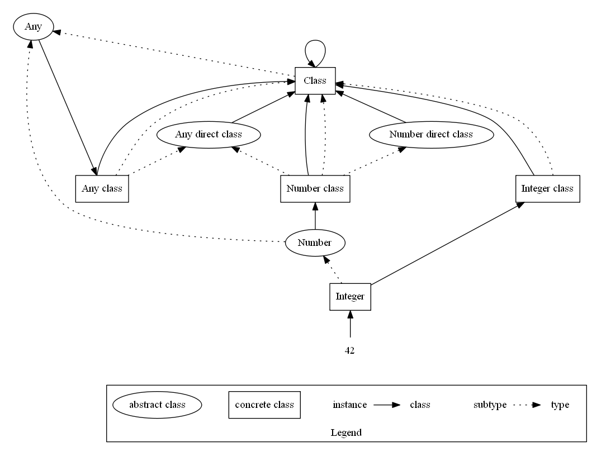

# Object Model

**Status**: WIP (partially implemented in transpiler)

**Identifier**: 014-object-model

**References**:
- Dropped design note: [011- Metaobject Protocol](design/old/011-metaobject-protocol.md)
- [Metaclasses are First Class: the ObjVLisp
  Model](http://stephane.ducasse.free.fr/Web/ArchivedLectures/p156-cointe.pdf)
  by Pierre Cointe.
- The Art of the Metaobject Protocol, by Gregor Kiczales, Jim des Rivieres, and
  Daniel G. Bobrow.
- [Traits: Composable Units of
  Behaviour](http://scg.unibe.ch/archive/papers/Scha03aTraits.pdf)
- [Efficient Multimethods in a Single Dispatch
  Language](http://www.laputan.org/reflection/Foote-Johnson-Noble-ECOOP-2005.pdf)
- [Flexible Object Layouts: Enabling Lightweight Language Extensions by
  Intercepting Slot
  Access](https://rmod.inria.fr/archives/papers/Verw11a-OOSPLA11-FlexibleObjectLayouts.pdf)
- [C3 linerarization](https://en.wikipedia.org/wiki/C3_linearization)

**History**:
- 2021-01-23: initial version by Nikodemus

## Problem Description

What is the Foolang object model?

### Decision Drivers

- Consistency & uniformity
- Allows runtime class allocation
- Allows later development of a more complete metaobject protocol
- Ease of understanding
- Ease of implementation

## Proposal

Figure 1.

Based on the ObjVLisp postulates:

1. An object represents a set of behaviours associated with some data.

2. The only protocol to invoke an object's behaviour is message passing: the
   object is responsible to invoking the appropriate behaviour(s) as a response
   to a message and it's arguments.
   
3. Every object belongs to a class that specifies it's data representation
   (slots) and behaviours (methods.) Objects generated from from this model
   are called instances of the class. Instances of a class share the same data
   representation and behaviour, but differ in data content.
   
4. A class is also an object, generated by another class, called it's metaclass.
   Consequently each class has an associated metaclass which describes it's
   data representation and behaviours. The initial primitive metaclass is
   _Class_, which is an instance of itself.
   
5. Instances of _Class_ which specify only behaviours with no data
   representation are called _abstract classes_, or _interfaces_. Abstract class
   behaviours may be specified as required but unimplemented. Non-abstract
   classes may be referred to as concrete classes for clarify, but typically a
   _class_ will refer to a concrete class and an _interface_ to an abstract
   class.

6. There are two subtyping relationships: _implementation_ and _extension_.
   
7. A class can _extend_ zero or one concrete classes. Extensions may _add_ slots
   or methods to the concrete class being extended, but cannot override them.
   
8. A class can _implement_ any number of abstract classes. The implementation
   may be similarly abstract or concrete.
   
   Implementations inherit behaviours specified by the implemented abstract
   classes.
   
   Metaclasses of implementations inherit the behaviours of metaclasses
   of the implemented abstract classes.
   
   Implementations and their metaclasses may override inherited behaviours, as
   long as declared argument types are non-variant and declared return types are
   co-variant.

   Concrete implementations must implement all required behaviours, but are
   otherwise unconstrained by the abstract classes they implement.
   
   Note that inheritance of metaclass behaviours classes is NOT subtyping:
   
   Relationship
   
       _MyClass_ implements _MyInterface_
       
   implies that both instances of _MyClass_ and the class object _MyClass_ provide
   the corresponding behaviours of _MyInterface_.
   
   This in turn implies the metaclass behaviour inheritance from _MyInterface
   class_ to _MyClass class_, but _MyClass class_ is NOT a subtype of _MyInterface
   class_!
   
9. The abstract class _Any_ represents the most common behaviour shared by all
   objects: all other classes are it's subtypes.

Figure 1. illustrates the parallel instantiation and subtyping relationships.
Ellipses represent abstract classes and rectangles concrete classes.

!> One way to sort this the metaclass inheriance without subtyping would be to
add an extra abstract metaclass for interfaces: Instead of having direct methods
of interfaces specified by the metaclass of the abstract interface class,
specify them in an abstract class implemented by both the interface metaclass
and metaclasses of implementing classes. This also re-introduces possibility of
_own_ methods for interfaces: provided by the interface object, but not part of
the inherited interface.
   
### Summary

Proposal outlines a uniform object model that seems to cover the cases Foolang
is driving towards.

The proposed model does not allow specification of undefined interface methods,
since they would reside in the interface metaclass, which must be concrete.

A possible relaxation of the model would be to allow specification of undefined
methods in concrete classes, and providing a _method missing_ error for them at
runtime.

This specification also implies that instance slots and instance method
definitions must be stored in slots of the metaclass, which in turn allows
metaclasses to provide reflective access to them when appropriate.

Not entirely satisfied with the behaviour inheritance without subtyping between
metaclasses.

#### Safety

None.

#### Ergonomics

Mixed impact. On one hand this is a fairly simple and clean model.

On the other hand the language level concept of _interface_ maps to an abstract
class, not it's own entity. It would probably be possible to add an _Interface_
metaclass to the system from which all interfaces would inherit, but that
doesn't seem to have any obvious benefits.

One future option would be to get rid of the language level interfaces as well,
making the models uniform.

#### Performance

None.

#### Uniformity

Positive impact. Cleans up the mess I had before nicely.

#### Implementation

Minor impact. On the transpiler side most of the work is already done, and the
mess needed to be cleaned up anyhow.

#### Users

No users, no impact.

## Alternatives

- See note at the end of proposal about adding metaclass subtyping for interfaces.
- Smalltalk model with an special Metaclass class.
- Having explicit interface objects (instead of abstract classes) in the model.

## Implementation Notes

Self hosted transpiler is on it's way to implementing this model. Bootstrap
implementation is different, and will likely remain that way until it gets
thrown out.

## Discussion

None.

