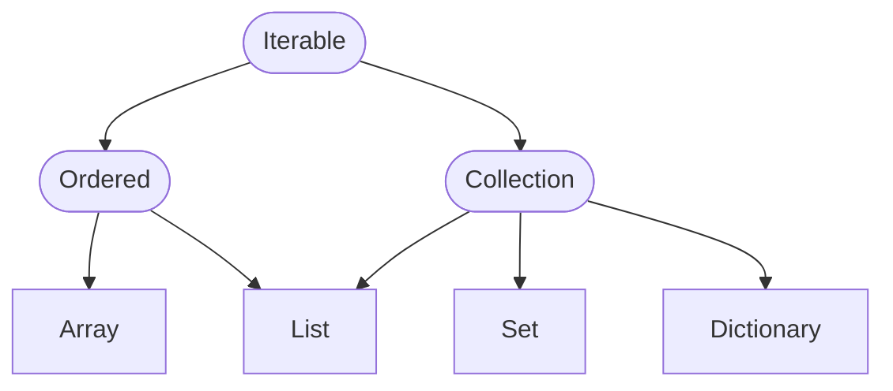
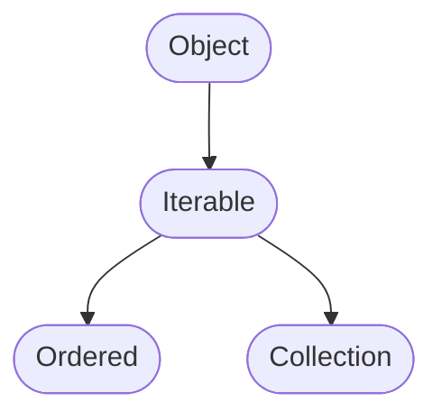
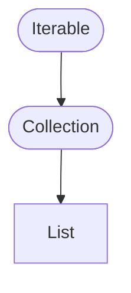
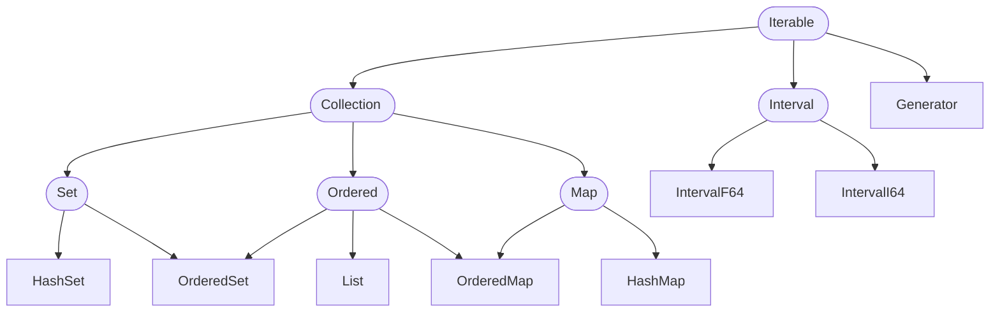

# Foolang Iterables



## Iterable



Iterable allows operations over elements of an object.

!> The `xxx:with:` methods might be moved out of iterable, since they are
tricky to define in a way that is consistent across different types of
collections.

### **required method** `iterator`

Returns an `Iterator` which iterates over the elements of the object. While
this is the only required method, it is strongly recommended that iterables
also implement the following methods: since the default implementations using
iterator are probably not nearly as efficient as specialized ones would be.

- `do:`
- `do:with:ifExhausted:`
- `elementType`
- `first`
- `isEmpty`
- `reduce:`
- `second`
- `sizeEstimate`

(Other methods are implemented using these, and should have reasonable performance.)

### *method* `allSatisfy:` _block_

Iterates over elements of the receiver, applying each to the _block_.

Returns `False` as soon as block evaluates to `False` for any element. Returns
`True` if block never evaluates to `False`.

### *method* `anySatisfy:` _block_

Iterates over elements of the receiver, applying each to the _block_.

Returns `True` as soon as block evaluates to `True` for any element. Returns
`False` if block never evaluates to `True`.

### *method* `collect:` _block_ `as:` _species_

Iterates over elements of the receiver, collecting results of applying each to
the _block_, by adding them to a _Collection_ created by sending a `#new`
message to the _species_.

Returns the collection.

### *method* `collect:` _block_ `into:` _collection_

Iterates over elements of the receiver, collecting results of applying each to
the _block_, by adding them to the _collection_.

Returns the collection.

### *method* `collect:` _block_ `with:` _other_ `as:` _species_

Iterates over elements of the receiver and _other_ in parallel, collecting
results of applying each pair to the _block_, by adding them to a _Collection_
created by sending a `#new` message to the _species_.

Iteration is terminated when either receiver or _other_ is exhausted.

Returns the collection.

Example:

``` foolang
let iterable1 = [1, 2, 3, 4].
let iterable2 = [100, 200].
iterable1
    collect: { |each1 each2| each1 + each2 }
    with: iterable2
    as: List --> [101, 202]
```

### *method* `collect:` _block_ `with:` _other_ `into:` _collection_

Iterates over elements of the receiver and _other_ in parallel, collecting
results of applying each pair to the _block_, by adding them to the _collection_.

Iteration is terminated when either receiver or _other_ is exhausted.

Returns the collection.

Example:

``` foolang
let iterable1 = [1, 2].
let iterable2 = [100, 200, 300].
iterable1
    collect: { |each1 each2| each1 + each2 }
    with: iterable2
    into: [0] --> [0, 101, 202]
```

### **method** `count:` _block_

Iterates over elements of the receiver, applying each to the _block_.

Returns the number of times the block evaluates to `True`.

### **method** `count:` _block_ `with:` _other_

Iterates over elements of the receiver and _other_ in parallel, applying
each pair to the _block_.

Returns the number of times the block evaluates to `True`.

### **method** `do:` _block_

Iterates over elements of the receiver, applying rach to the _block_.

Returns the receiver.

### **method** `do:` _block_ `with:` _other_

Iterates over elements of the receiver and _other_ in parallel, applying
each pair to the _block_.

Returns the receiver.

If either receiver or _other_ is exhausted before the other, returns the
receiver

### **method** `do:` _block_ `with:` _other_ `ifExhausted:` _exhaustedBlock_

Iterates over elements of the receiver and _other_ in parallel, applying
each pair to the _block_.

Returns the receiver.

If the _other_ is exhausted before the receiver, uses results of evaluting the
_exhaustedBlock_ for the missing elements of _other_.

### **method** `elementType`

Returns the element type of the iterator: all elements of the iterator
are of this type. Defaults to `Object`, implementing classes that restrict
this must also enforce it.

### **method** `equals:` _other_

Returns `True` if elements of the _other_ match elements of the receiver.

### **method** `find:` _block_

Iterates over elements of the receiver, applying each to _block_.

If the block evaluates to `True` for any element, returns that element
immediately. If the block doesn't evaluate true for any element returns `False`
instead.

### **method** `find:` _block_ `ifNone:` _noneBlock_

Iterates over elements of the receiver, applying each to _block_.

If the block evaluates to `True` for any element, returns that element
immediately. If the block doesn't evaluate true for any element evaluates
the _noneBlock_ and returns its value instead.

### **method** `first`

Returns the first element of the receiver. Raises an error if
there are no elements.

### **method** `ifEmpty:` _emptyBlock_

If the receiver is empty evaluates the _emptyBlock_ and returns its value.
Otherwise returns `False`.

### **method** `ifEmpty:` _emptyBlock_ `ifNotEmpty:` _notBlock_

If the receiver is empty evaluates the _emptyBlock_ and returns its value.
Otherwise evaluates the _notBlock_ and returns its value.

### **method** `ifNotEmpty:` _notBlock_

If the receiver is empty returns `False`, otherwise evaluates the _notBlock_
and returns its value.

### **method** `includes:` _object_

Returns `True` any of the elements of the receiver is equal to the _object_
as if by `#==`, and `False` otherwise.

### **method** `includesAll:` _other_

Iterates over elements of the _other, checking if they are all members of
the receiver as if by `includes:`.

### **method** `inject:` _initialValue_ `into:` _block_

Iterates over elements of the receiver, applying an accumulator and each
element to the _block_. Accumulator starts as _initialValue_
and is updated to value of the block after each evaluation.

Returns the evaluator.

### **method** `inject:` _initialValue_ `into:` _block_ `with:` _other_

Iterates over elements of the receiver and _other_ in parallel, applying an
accumulator and each pair to the _block_. Accumulator starts as _initialValue_
and is updated to value of the block after each evaluation.

### **method** `isEmpty`

Returns true if receiver is empty.

### **method** `isEquivalent:` _other_

Delegates to `equals:`: returns `True` if elements of the _other_ match elements
of the receiver.

### **method** `max:` _block_

Iterates over elements of the receiver, applying each to the _block_. Returns
maximum element as determined by comparing values the block evaluates to with
`#<`.

### **method** `max`

Iterates over elements of the receiver, returns the maximum element as
determined by comparing them with `#<`.

### **method** `min:` _block_

Iterates over elements of the receiver, applying each to the _block_. Returns
minimum element as determined by comparing values the block evaluates to with
`#<`.

### **method** `min`

Iterates over elements of the receiver, returns the minimum element as
determined by comparing them with `#<`.

### **method** `reduce:` _block_

If the receiver has only a single element, returns it. Otherwise iterates over
subsequent elements of the receiver, applying an accumulator and each to the
_block_. Accumulator starts as first element of the receiver, and is updated to
value of the block after each evaluation.

### **method** `second`

Returns second element of the receiver.

### **method** `select:` _block_ `as:` _species_

Iterates over elements of the receiver, applying each to the _block_. Adds those
elements for which the block returns `True` to a _Collection_ created by sending
a `#new` message to the _species_.

Returns the collection.

### *method* `select:` _block_ `into:` _collection_

Iterates over elements of the receiver, applying each to the _block_. Adds those
elements for which the block returns `True` to the _collection_.

Returns the collection.

### *method* `sizeEstimate`

Returns the estimated number of elements in the receiver, or the exact
number if known (ie. if it can be determined in O(1) time.) Returns zero
if the receiver is empty, and a number greater than zero if the receiver
is not empty.

### *method* `sum:` _block_

Iterates over elements of the receiver, applying each to the _block_. Returns
the sum of values that the block evaluates to.

### *method* `sum`

Iterates over elements of the block, returning their sum.

?> There is no `#reject:as` or `#reject:into` since those names are too
confusing.

## Collection



Finite. Support creation, addition of elements, and removal of elements.

### *required direct method* `of:` _type_ `withCapacity:` _capacity_

Creates a new _Collection_ specialized to contain elements of _type_ which
can hold upto _capacity_ items without needing to grow.

### *required method* `add:` _element_

Adds _element_ to receiver.

### *required method* `remove:` _element_

Remove _element_ from the receiver.

### *required method* `clear`

Removes all elements from the receiver.

- required method `clear`
- required method `remove:`
- required method `removeIf:`
- required method `size`
- direct method `defaultCapacity`
- direct method `defaultElementType`
- direct method `from:`
- direct method `new:`
- direct method `new:default:`
- direct method `new`
- direct method `of:from:`
- direct method `withCapacity:`
- method `addAll:`
- method `as:`
- method `collect:`
- method `copy`
- method `reject:`
- method `remove:`
- method `removeAll:`
- method `removeIfNot:`
- method `reserveCapacity`
- method `select:`
- method `with:collect:`

### Indexed < Iterable

- required direct method `of:new:value:`
- direct method `new:`
- required method `at:`
- required method `at:put:`

### List < Indexed, Collection

### Array < Indexed

!> Would also like a method of operating on slices, reflecting the changes
back to original. Would make `(x from: start to: end) rotateLeft: n` work
like magic.

!> Need better documentation structure to be able to define things like
"violating bounds causes an exception to be raised" without needing to
repeat them over and over again.



## Iterable

A potentially infinite sequence of objects that can be iterated over.

- **required method** `iterator`

  Returns an _Iterator_ object that can be used to step over the collection
  using messages `next`, `atEnd`, and `tryNext:`.

  ---

- **method** `do:` _block_ \
  Executes _block_ repeatedly, with each object in the receiver.
  Returns the receiver.

- **method** `inject:` _initialValue_ `into:` _block_ \
  Returns the result of executing _block_ repeately with an accumulator
  and each object in the receiver. Accumulator starts as _initialValue_
  and is updated to value returned by _block_ after each execution.

- **method** `with:` _iterable2_ `do:` _block_ \
  Executes _block_ repeatedly, with each object in the receiver and
  the corresponding object in _iterable2_.
  If the receiver is exausted before _iterable2_, the elements remaining
  in _iterable2_ are ignored.
  If _iterable2_ is exhausted before the receiver, an exception is raised.
  Returns the receiver.

- **method** `with:` _iterable2_ `inject:` _initialValue_ `into:` _block_ \
  Returns the result of executing _block_ repeatedly with an accumulator, each
  object in the receiver, and the corresponding object in _iterable2_.
  Accumulator starts as _initialValue_
  and is updated to value returned by _block_ after each execution.
  If the receiver is exausted before _iterable2_, the elements remaining
  in _iterable2_ are ignored.
  If _iterable2_ is exhausted before the receiver, an exception is raised.

  ---

- **method** `ifEmpty:` _block_ \
  If receiver is empty executes _block_ and returns its value.
  Otherwise returns false.

- **method** `ifEmpty:` _emptyBlock_ `ifNotEmpty:` _notEmptyBlock_ \
  If receiver is empty executes _emptyBlock_ and returns its value.
  Otherwise executes _notEmptyBlock_ and returns its value.

- **method** `ifNotEmpty:` _block_ \
  If receiver is not empty executes _block_ and returns its value.
  Otherwise returns false.

- **method** `isEmpty` \
  Returns true if the collection is empty and false otherwise.

## Collection

A finite collection of objects, allowing addition of new elements.

- **required method** `size` \
  Returns the number of objects in the collection.

- **required method** `species` \
  Returns the class that should be used to construct new instances of the
  collection. The class must understand following messages:
  - `new` which returns a new, empty instance of the collection
  - `newWithCapacity:` which returns a new, empty instance of the collection
     sized to hold the specified number of objects.

- **required method** `add:` _object_ \
  Adds a new object to the collection. Size of the collection typically
  increases by one as a result.

  ---

- **method** `collect:` _block_ \
  Executes _block_ repeatedly, with each object in the receiver.
  Returns a new collection of the same species as the receiver, containing the
  objects returned by _block_.

- **method** `with:` _collection2_ `collect:` _block_ \
  Executes _block_ repeatedly, with each object in the receiver, and
  the corresponding object from _collection2_.
  Returns a new collection of the same species as the receiver containing the
  objects returned by _block_.
  If the receiver is exausted before _collection2_, the elements remaining
  in _collection2_ are ignored.
  If _collection2_ is exhausted before the receiver, an exception is raised.

  ---

- **method** `allSatisfy:` _block_ \
  Returns true if _block_ is true for all objects in the receiver,
  false otherwise.

- **method** `addAll:` _iterable_ \
  Add all objects in the _iterable_ to the receiver.

- **method** `anySatisfy:` _block_ \
  Returns true if _block_ is true for at least one object in the receiver,
  false otherwise.

- **method** `count:` _block_ \
  Returns the number of objects in receiver for which _block_ returnes true.

- **method** `find:` _block_ \
  Executes _block_ repeatedly, with each object in the receiver,
  until it find one where block returns true.
  Returns the object for which the block returned true, or
  raises an exception if no such object was found.

- **method** `find:` _block_ `ifNone:` _noneBlock_ \
  Executes _block_ repeatedly, with each object in the receiver,
  until it find one where block returns true.
  Returns the object for which the block returned true, or
  if no such object was found executes the _noneBlock_ and returns
  its value.

- **method** `includes:` _object_ \
  Returns true if receiver contains the _object_, false otherwise.

- **method** `reject:` _block_ \
  Executes _block_ repeatedly, with each object in the receiver.
  Returns a new collection of the same species as the receiver, containing the
  objects for which _block_ returned false.

- **method** `select:` _block_ \
  Executes _block_ repeatedly, with each object in the receiver.
  Returns a new collection of the same species as the receiver, containing the
  objects for which _block_ returned true.

## Set

Sets are collections which contain each object only once: adding the same object
multiple times to a set is same as adding it once.

!> This seems a bit awkward. All of these could in principle be supported by any
collection. It's just that sets are designed to make these operations efficient
and maintain the invariant.

- **method** `intersection:` _iterable_ \
  Returns a fresh set of the same species as the receiver containing
  those objects in the receiver that also appear in the _iterable_.

- **method** `difference:` _iterable_ \
  Returns a fresh set of the same species as the receiver containing
  those objects in the receiver that do not appear in the _iterable_.

- **method** `union:` _iterable_ \
  Returns a fresh set of the same species as the receiver containing
  objects in the receiver and those of the _iterable_.

## Ordered

Ordered collections allow accessing their members by integer indexes from 1 to
size of the collection. Iteration order of an Ordered collection is from index 1
upwards. `add:` method adds to the end.

- **required method** `at:` _index_ \
  Returns the object at the specified _index_ in the receiver. Raises an exception
  if the _index_ is less than one or greater than size of the receiver.

- **required method** `at:` _index_ `put:` _object_ \
  Puts the _object_ at the specified _index_ in the receiver. Raises an
  exception if the index is less than one or greater than size of the
  receiver.

- **required method** `removeFirst` \
  Returns first element in the receiver, and removes it.

- **required method** `removeLast` \
  Returns last element in the receiver, and removes it.

- **method** `from:` _start_ `to:` _end_ \
  Returns a new ordered collection of
  the same species containing elements from _start_ to _end_. Raises an
  exception if either _start_ or _end_ is less than one or greater than size of
  the receiver.

  _XXX: a lot of methods should probably have variants prefixed with `from:to:`,
  along the lines of `from: i to: j select: test`._

- **method** `from:` _start_ `to:` _end_ `replaceFrom:` _iterable_
  Replaces elements of the receiver from _start_ to _end_ with elements from
  _iterable_. Raises an exception is _iterable_ is exhausted before specified
  range has been replaced.

  _XXX: or maybe the answer is to have slices/iterators that allow mutation:
  `(seq from: start to: end) replaceFrom: other`. This is also very close
  to the slicing and broadcasing protocol I was thinking about for arrays:
  `seq at: (start to: end) put: replacement` -- but needs a bit of finesses
  to be able to communicate `replaceFrom:` vs `replaceWith:` type operations._

- **method** `from:` _start_ `to:` _end_ `replaceWith:` _object_
  Replaces elements of the receiver from _start_ to _end_ with _object_.

- **method** `index:` _object_ \
  Returns first position of _object_ in the receiver. Raises an exception
  if _object_ is not in receiver.

  _XXX: should there be also `indexes:`?_

- **method** `index:` _object_ `ifNone:` _block_ \
  Returns first position of _object_ in the receiver. Executes _block_
  if _object_ is not in receiver, and returns its value.

- **method** `indexIf:` _block_ \
  Returns position of first _object_ in the receiver for which _block_
  returns true. Raises an exception if _object_ is not in receiver.

- **method** `indexIf:` _block_ `ifNone:` _noneBlock_ \
  Returns position of first _object_ in the receiver for which _block_ returns
  true. Executes _noneBlock_ if _object_ is not in receiver, and returns its value.

- **method** `reverse` \
  Reverses the receiver in place.

- **method** `reversed` \
  Returns copy of the receiver, in reverse order in reverse order.

- **method** `rotateLeft:` _n_
  Rotates elements of receiver left _n_ times.

- **method** `rotateRight:` _n_
  Rotates elements of receiver right _n_ times.

- **method** `sort:` _block_ \
  Sorts the receiver using _block_ as comparator: _block_ is called
  with two objects from the receiver in time, and should return true
  if the first element belong before second one.

- **method** `sorted:` _block_ \
  Returns a new ordered collection of the same
  species as the receiver, using _block_ as comparator: _block_ is called with
  two objects from the receiver in time, and should return true if the first
  element belong before second one.

## Map

Map collections provide mappings from one object to another. Often also called
dictionaries, tables, or hashtables.

- **required method** `at:` _key_ `ifNone:` _block_ \
  Returns the object associated with _key_ in the receiver, or exceutes the
  _block_ returning its value if no such object exists.

- **required method** `at:` _key_ `put:` _object_ \
  Associates _object_ with _key_ in the receiver. If an older association
  already existed, it is replaced.

## Interval

Interval represents a range of numbers, plus an step size.
